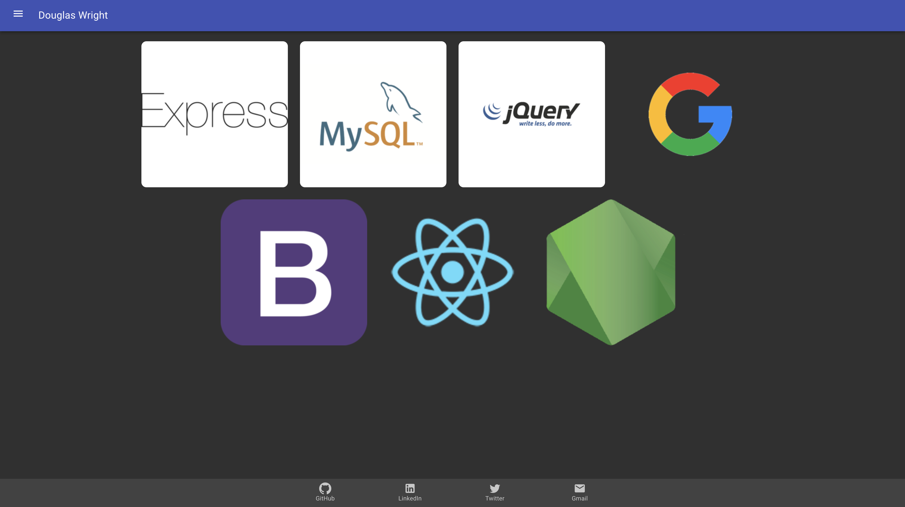

# React Portfolio

An example portfolio page built with React & Material UI.

  
  

## Getting Started

Play on my [site](https://dgwiii.github.io/react-portfolio/projects/personal) or host locally after cloning from the [Repo](https://github.com/Spazcool/react-portfolio).

### Prerequisites

A browser and an internet connection is all you'll need.

### Installing

No installation required.

## Built With

* JS, jQuery & React
* Material UI
* ReactIcons

## Authors

* **Douglas Wright** - [Spazcool](https://github.com/Spazcool)

## License

This project is licensed under the MIT License - see the [LICENSE.md](LICENSE.md) file for details
